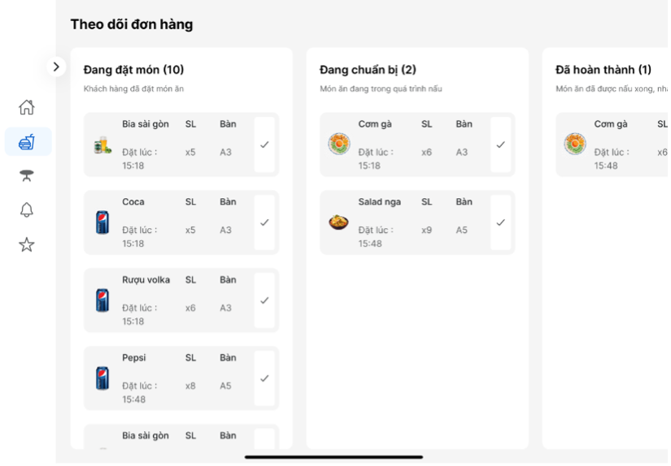

# 🍽️ Restaurant Ordering App - React Native & Next.js

A modern restaurant ordering system designed to enhance customer experience and streamline staff workflows. This project includes:

- 📱 **Mobile app** for customers (React Native)
- 📱 **Mobile app** for staff (React Native)
- 🖥️ **Admin website** for administrators (Next.js)

## 🚀 Main Features

### 👥 For Customers
- Register/Login
- Browse menu
- Place food and table orders
- Track dish preparation status
- Pay via QR code or cash
- Leave feedback and reviews

### 👨‍🍳 For Staff
- Receive and manage orders
- Update food preparation status
- Assist with payments
- Manage table reservations

### 🛠 For Admins (Web)
- Manage users and roles
- Manage menu and dining zones
- Track revenue and promotions

## 🔐 User Roles

- 👤 **Customer**: place orders, provide reviews
- 🧑‍🍳 **Staff**: manage orders and assist payment
- 🧑‍💼 **Admin**: manage system, users, and data

## 💳 Payment Methods

- ✅ **QR Code**: encode order information for bank verification
- 💵 **Cash**: manually confirmed by staff

## 🧰 Technologies Used

| Component        | Technology                   |
|------------------|------------------------------|
| Mobile App       | React Native                 |
| Web Admin        | Next.js                      |
| Backend/API      | RESTful API (NestJS)         |
| Database         | MySQL                        |
## 🖼️ Screenshots
### 👨‍🍳 Mobile App - Staff

### 📲 Mobile App - Customer

### 🖥️ Web Admin

